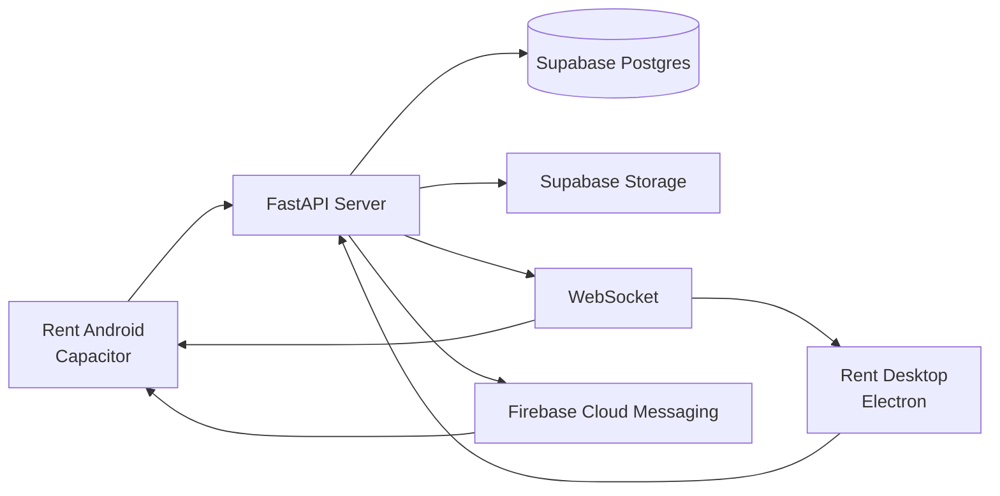

<div align="center">


# Rent

### Private messaging, without the noise.

Современное приложение для защищённого общения между Android и desktop.  
Фиолетовый интерфейс, быстрые чаты, медиа, голосовые сообщения и синхронизация в реальном времени.

<br>


</div>

---

## О проекте

**Rent** — это приватный мессенджер, который собирается как единая экосистема для телефона и компьютера.

Приложение создано вокруг простого сценария:

1. открыть приложение;
2. сразу увидеть свои чаты;
3. найти человека через быстрый поиск;
4. отправить сообщение, фото, видео или голосовое;
5. продолжить разговор на другом устройстве без ручного обновления.

Rent пока находится в активной разработке. Интерфейс, серверная часть и мобильный клиент продолжают улучшаться, поэтому некоторые функции могут меняться до первого стабильного релиза.

> **Важно:** этот проект не является Open Source. Репозиторий опубликован как презентационная и рабочая страница проекта. Исходный код, серверная инфраструктура и сборки не предназначены для свободного форка или коммерческого использования.

---

## Что уже есть

### Чаты

- Telegram-подобный список диалогов;
- отдельный полноэкранный экран чата на телефоне;
- поиск пользователей по имени, username или Rent ID;
- синхронизация списка чатов между устройствами;
- обновления в реальном времени через WebSocket;
- быстрый локальный кэш списка диалогов;
- сохранение последнего состояния сессии.

### Сообщения и медиа

- текстовые сообщения;
- ответы на сообщения;
- редактирование и удаление;
- реакции;
- пересылка;
- изображения;
- видео;
- аудиофайлы;
- голосовые сообщения;
- полноэкранный media viewer;
- загрузка файлов через серверное хранилище.

### Аккаунт и приватность

- регистрация через email;
- подтверждение кода;
- код подтверждения внутри приложения в dev-режиме;
- авторизация с сохранением сессии;
- уникальный Rent ID;
- профиль, аватар и описание;
- светлая и тёмная тема;
- локальное хранение сессии на Android через Capacitor Preferences.

### Мобильное приложение

- phone-first интерфейс;
- нижняя навигация;
- Android Back;
- touch actions и long press;
- локальный fallback для иконок;
- системные уведомления;
- FCM-контур для push-уведомлений;
- сборка в APK через Capacitor.

---

## Архитектура



### Клиенты

- **Android** — Capacitor 6, phone-first HTML/CSS/JS оболочка;
- **Desktop** — Electron;
- общий chat/auth/business logic;
- отдельный мобильный слой для навигации и touch UX.

### Сервер

- FastAPI;
- JWT-сессии;
- WebSocket real-time events;
- Supabase Postgres;
- Supabase Storage;
- FCM push delivery;
- валидация пользователей, файлов и сообщений.

---

## Визуальный стиль

Rent использует спокойную тёмную основу с фиолетовым акцентом:

| Элемент | Цвет |
| --- | --- |
| Основной акцент | `#8B7CFF` |
| Акцентный hover | `#7567EF` |
| Тёмный фон | `#0A0B0F` |
| Поверхность | `#141720` |
| Успешный статус | `#4EDC8B` |

Интерфейс телефона построен вокруг коротких переходов, больших touch targets, safe-area отступов и минимального количества визуального шума.

---

## Скриншоты

Визуальные материалы будут добавлены после стабилизации текущего мобильного интерфейса.

Пока в качестве brand preview используется официальная иконка проекта:

<div align="center">
  
</div>

---

## Быстрый старт для разработки

### Android-клиент

```powershell
Set-Location ".\Mobile"
npm install
npm run sync
```

Сборка debug APK:

```powershell
Set-Location ".\Mobile"
.\android\gradlew.bat -p android assembleDebug
```

APK появится здесь:

```text
Mobile/android/app/build/outputs/apk/debug/app-debug.apk
```

### Backend

Сервер находится в директории `Server`.

Основные переменные окружения:

```env
DATABASE_URL=...
JWT_SECRET=...
SUPABASE_URL=...
SUPABASE_SERVICE_KEY=...
SUPABASE_BUCKET=...
DEV_SHOW_VERIFICATION_CODE=true
FCM_SERVICE_ACCOUNT_JSON=...
```

`DEV_SHOW_VERIFICATION_CODE=true` нужен только для разработки, пока SMTP/Gmail ещё не настроен. Для production его следует отключить.

---

## Обновления

Автообновление Android-клиента через GitHub Releases планируется после публикации первого стабильного APK-релиза.

До этого APK собирается вручную и распространяется как debug/private build. После появления production release в репозитории появятся:

- versioned APK assets;
- release notes;
- changelog;
- проверка новой версии внутри приложения;
- кнопка обновления с переходом на страницу релиза.

---

## Roadmap

- [x] Phone-first Android UI
- [x] Telegram-style chat navigation
- [x] Persistent mobile session
- [x] WebSocket chat updates
- [x] Media attachments
- [x] Voice recording pipeline
- [x] Push notification foundation
- [x] Group conversation foundation
- [ ] Stable group E2EE key envelopes
- [ ] Production SMTP flow
- [ ] GitHub Releases updater
- [ ] Stable public beta
- [ ] Final visual polish and accessibility pass

---

## Статус проекта

**Текущий этап:** активная закрытая разработка.

Rent ещё не готов считаться стабильным публичным продуктом. Сейчас приоритет — надёжность чатов, корректная синхронизация между Android и desktop, медиа, push-уведомления и финальная полировка интерфейса.

Это не демо-страница и не обещание готового SaaS. Это рабочая витрина проекта, который ещё собирается.

---

<div align="center">

### Rent — private conversations, built carefully.

**Private project · In development · Not Open Source**

</div>
