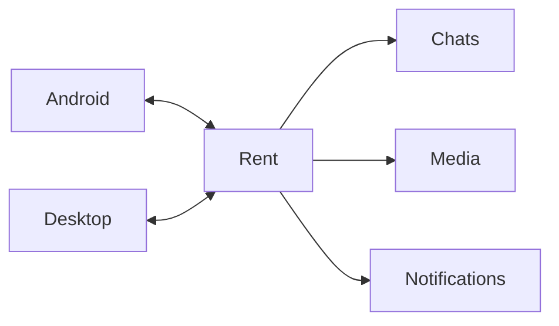

# Rent

### Private messaging, without the noise.

Современное приложение для защищённого общения между Android и desktop.  

 

---

## О проекте

**Rent** — это приватный мессенджер!

Приложение создано вокруг простого сценария:

1. открыть приложение;
2. сразу увидеть свои чаты;
3. найти человека через быстрый поиск;
4. отправить сообщение, фото, видео или голосовое;
5. продолжить разговор на другом устройстве без ручного обновления.

Rent пока находится в активной разработке. Интерфейс, мобильный клиент и desktop-версия продолжают улучшаться, поэтому некоторые функции могут меняться до первого стабильного релиза.

> **Важно:** этот проект не является Open Source. Репозиторий опубликован как презентационная и рабочая страница проекта. Исходный код и сборки не предназначены для свободного форка или коммерческого использования.

---

## Что уже есть

### Чаты

- отдельный полноэкранный экран чата на телефоне;
- поиск пользователей по имени, username или Rent ID;
- синхронизация списка чатов между устройствами;
- обновления в реальном времени через WebSocket;
- быстрый локальный кэш списка диалогов;
- сохранение последнего состояния сессии.

### Сообщения и медиа

- текстовые сообщения;
- ответы на сообщения;
- редактирование и удаление;
- реакции;
- пересылка;
- изображения;
- видео;
- аудиофайлы;
- голосовые сообщения;
- полноэкранный media viewer;
- отправка и просмотр медиафайлов прямо в переписке.

### Аккаунт и приватность

- регистрация через email;
- подтверждение кода;
- код подтверждения внутри приложения в dev-режиме;
- авторизация с сохранением сессии;
- уникальный Rent ID;
- профиль, аватар и описание;
- светлая и тёмная тема;
- локальное хранение сессии на Android через Capacitor Preferences.

### Мобильное приложение

- phone-first интерфейс;
- нижняя навигация;
- Android Back;
- touch actions и long press;
- локальный fallback для иконок;
- системные уведомления;
- FCM-контур для push-уведомлений;
- сборка в APK через Capacitor.

---

## Клиентский опыт

---

## Статус проекта

**Текущий этап:** активная закрытая разработка.

Rent ещё не готов считаться стабильным публичным продуктом.

Это не демо-страница и не обещание готового SaaS. Это рабочая витрина проекта, который ещё собирается.

---

### Rent — private conversations, built carefully.

**Private project · In development · Not Open Source**

